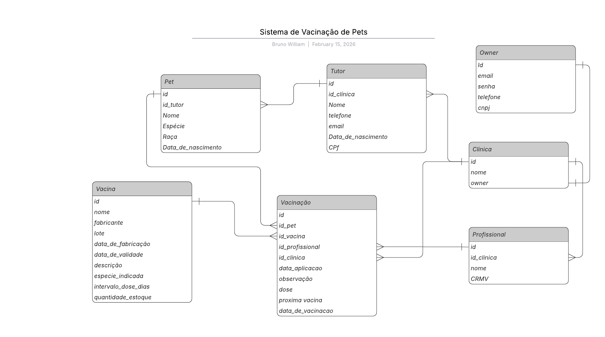

# Sistema de Vacinação de Pets White Label/Multi Tenant 🐾💉

## Visão Geral

O **Sistema de Vacinação de Pets** é uma aplicação web desenvolvida para gerenciar o cadastro de pets, clínicas, profissionais de saúde e controle de vacinas.  
Ele permite que **múltiplas clínicas utilizem o sistema simultaneamente**, acompanhando de forma independente o histórico de vacinação dos pets, cadastrando profissionais e vacinas, e gerenciando informações de forma segura e organizada.

O sistema foi desenvolvido com foco em **facilidade de uso, modularidade e escalabilidade**, sendo uma solução prática para clínicas veterinárias de pequeno, médio e grande porte.
---
## Diagrama MER

O **Diagrama MER (Modelo Entidade-Relacionamento)** mostra a estrutura de dados do sistema, representando todas as entidades principais e seus relacionamentos:
- **Owner** → Usuário mestre responsável pela gestão da clínica. Existe uma relação de exclusividade onde cada clínica está obrigatoriamente vinculada a um owner.
- **Clínica** → Cada clínica possui seus próprios **profissionais**,**tutores**, **pets**, **vacinas** e **vacinação**, permitindo uso multi-clínicas.  
- **Tutor** → Representa o dono do pet, vinculado a uma clínica.  
- **Pet** → Cada pet pertence a um tutor e pode receber diversas vacinas ao longo do tempo.  
- **Vacina** → Lista de vacinas disponíveis na clinica.  
- **Vacinação** → Registra a aplicação de uma vacina em um pet, realizada por um profissional em uma clínica.  
- **Profissional** → Profissionais vinculados a clínicas, responsáveis pela aplicação das vacinas.

Esse diagrama garante que **os dados sejam consistentes e relacionados corretamente**, facilitando consultas e mantendo a integridade entre pets, tutores, profissionais e vacinas.

## Tecnologias Utilizadas

- **Linguagem:** Python 3 
- **Framework Web:** Django (com Django REST Framework para APIs)  
- **Banco de Dados:** SQLite  
- **Gerenciamento de Dependências:** pip / virtualenv  
- **Controle de Versão:** Git / GitHub  

---
## Decisões de Negócio

### Vacinações (Core do Sistema)

Este é o núcleo do sistema, responsável pelo registro das vacinações dos pets, estabelecendo a vinculação entre o animal, a vacina aplicada e o profissional responsável pelo procedimento.
A vacinação constitui um registro histórico e auditável, garantindo a rastreabilidade das informações clínicas. Por esse motivo:
- Não é permitida a edição do registro após sua criação.
- Não é permitida a exclusão de registros.
- A integridade do histórico do pet é preservada.

Essa decisão evita alterações indevidas que possam comprometer a segurança clínica, a confiabilidade dos dados e possíveis auditorias futuras.

### Vacinas

A entidade Vacina foi modelada com foco em:

- Rastreabilidade de lotes
- Controle de validade
- Controle de fabricante
- Possível expansão para gestão de estoque

A modelagem já considera um cenário futuro de:
- Controle de entrada e saída de estoque
- Alertas de vencimento
- Relatórios de uso por período

### Pets

Os pets possuem:

- Histórico completo de vacinações
- Controle de próxima dose
- Associação direta com tutor
- Essa estrutura permite:
- Controle de calendário vacinal
- Alertas de próximas vacinas
- Histórico clínico consolidado

### Tutores

Os tutores possuem acesso direto aos seus pets.
A modelagem atual permite futura expansão para:
- Login exclusivo para tutor
- Visualização de histórico de vacinação
- Agendamento online
- Notificações de próxima vacina

Essa decisão abre caminho para transformar o sistema de uso interno em uma plataforma de relacionamento com o cliente.

---

## Tecnologias Utilizadas

- **Linguagem:** Python 3 
- **Framework Web:** Django (com Django REST Framework para APIs)  
- **Banco de Dados:** SQLite  
- **Gerenciamento de Dependências:** pip / virtualenv  
- **Controle de Versão:** Git / GitHub  

---

## 🐳 Rodando com Docker
Este projeto está pronto para ser executado em containers. Certifique-se de ter o Docker instalado em sua máquina.

Para criar a imagem do Docker, execute o comando abaixo na raiz do projeto:

`
docker build -t sistemadevacinacao .
`

Após o build, você pode iniciar o sistema com o seguinte comando:

`
docker run -it --name sistemadevacinacao sistemadevacinacao
`

---

## Descrição Geral das Rotas / Endpoints

### Register
- `POST /api/register/` → Cria novo Owner

### Login
- `POST /api/login/` → Login do Owner

### Logout
- `POST /api/logout/` → Logout do Owner

### Clínicas
- `POST /api/clinica/` → Cria nova clínica  
- `GET /api/clinica/<id>/` → Detalhes de uma clínica  
- `PUT /api/clinica/<id>/` → Atualiza clínica  
- `DELETE /api/clinica/<id>/` → Remove clínica  

### Profissionais
- `GET /api/profissionais/` → Lista profissionais  
- `POST /api/profissionais/` → Cria profissional  
- `GET /api/profissionais/<id>/` → Detalhes do profissional  
- `PUT /api/profissionais/<id>/` → Atualiza profissional  
- `DELETE /api/profissionais/<id>/` → Remove profissional  

### Tutores
- `GET /api/tutor/` → Lista todos os tutores  
- `POST /api/tutor/` → Cadastra novo tutor  
- `GET /api/tutor/<id>/` → Detalhes do tutor  
- `PUT /api/tutor/<id>/` → Atualiza tutor  
- `DELETE /api/tutor/<id>/` → Remove tutor  

### Pets
- `GET /api/pets/` → Lista todos os pets  
- `POST /api/pets/` → Cadastra novo pet  
- `GET /api/pets/<id>/` → Detalhes do pet  
- `PUT /api/pets/<id>/` → Atualiza pet  
- `DELETE /api/pets/<id>/` → Remove pet  

### Vacinas
- `GET /api/vacina/` → Lista vacinas  
- `POST /api/vacina/` → Cadastra nova vacina  
- `GET /api/vacina/<id>/` → Detalhes da vacina  
- `PUT /api/vacina/<id>/` → Atualiza vacina  
- `DELETE /api/vacina/<id>/` → Remove vacina  

### Vacinações (registro de aplicação de vacinas)
- `GET /api/vacinacao/` → Lista todas as vacinações realizadas  
- `POST /api/vacinacao/` → Registra uma nova vacinação (pet + vacina + data + profissional)  
- `GET /api/vacinacao/<id>/` → Detalhes de uma vacinação específica  

## Link da documentação Postman
https://documenter.getpostman.com/view/45775604/2sBXcBoNcc

